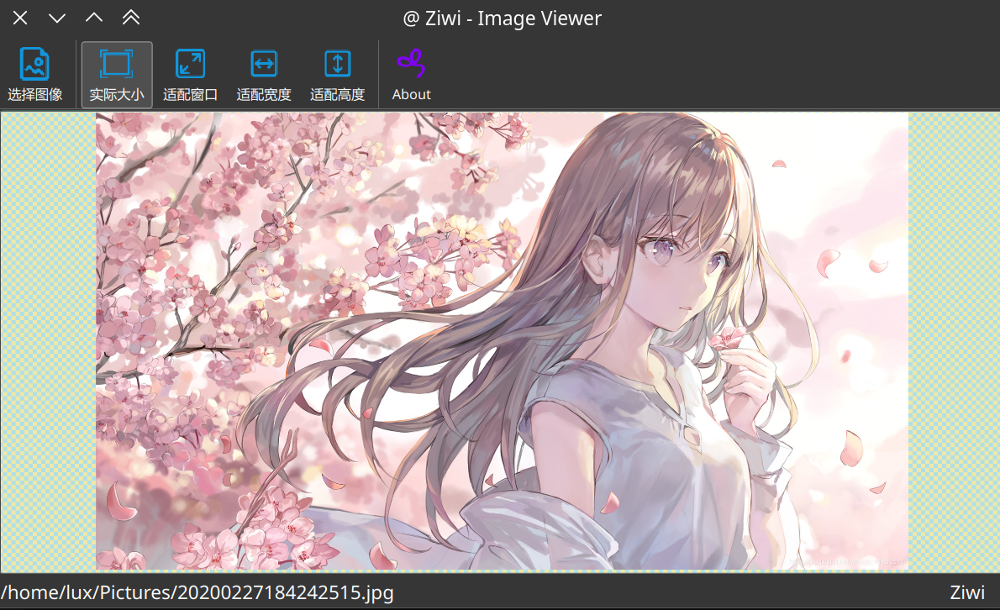

# Ziwi

<div align=center></div>

**Ziwi is a free and open source image viewer, based on Qt5 and OpenCV4, implemented in C++ programming. It can be used to view 8 bits / 12 bits / 16 bits Bayer images, but also supports a variety of common image formats, such as PNG, JPG, TIFF, SVG, etc.**

**Ziwi 是一个免费且开源的图像查看器，基于 Qt5 和 OpenCV4，采用 C++ 编程实现。可以用于查看 8 bits / 12 bits / 16 bits 的 Bayer 图像，同时也支持各种常见的图片格式，例如 PNG、JPG、TIFF、SVG等。**

## Environment Requirements / 环境依赖

- C++ 17 (filesystem)
- OpenCV 4.7.0
- Qt 5.15.9
- GCC / Clang
- Linux (ArchLinux / Manjaro)  / Window10

## Evnironment Install / 环境安装

- OpenCV 4.7.0

    ```bash
        # step 1
        wget https://github.com/opencv/opencv/archive/4.7.0.zip

        # step 2
        unzip 4.7.0.zip

        # step 3
        cd opencv-4.7.0
        mkdir build
        cd build

        # step 4
        cmake -DCMAKE_BUILD_TYPE=RELEASE \
            -DCMAKE_INSTALL_PREFIX=./install \
            -DBUILD_SHARED_LIBS=ON \
            -DCMAKE_INSTALL_LIBDIR=lib64 \
            -DOPENCV_FORCE_3RDPARTY_BUILD=ON \
            -DBUILD_DOCS=OFF \
            -DBUILD_EXAMPLES=OFF \
            -DWITH_IPP=OFF \
            -DBUILD_TESTS=OFF ..

        # step 5
        make -j 16

        # step 6 (optional)
        make install
    ```

- Qt 5.15.9

    ``` bash
        Manjaro (Archlinux) 自带，安装省略
    ```

## Screenshots / 截图

<div align=center></div>

## Todo-List

- [x] 添加普通对象查看功能
