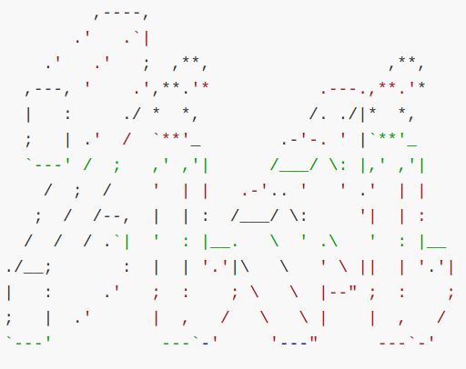

# Ziwi

<div align=center></div>

**Ziwi is a simple image viewer based on Qt5 and OpenCV4. It can display raw images(8/12/16 bits).**

## Environment Requirements

- OpenCV 4.7.0
- Qt 5.15.9
- GCC 12.2.1 / Clang 15.0.7
- Linux(Manjaro) / Window10

## Evnironment Install

- OpenCV 4.7.0

    ```bash
        # step 1
        wget https://github.com/opencv/opencv/archive/4.7.0.zip

        # step 2
        unzip 4.7.0.zip

        # step 3
        cd opencv-4.7.0
        mkdir build
        cd build

        # step 4
        cmake -DCMAKE_BUILD_TYPE=RELEASE \
            -DCMAKE_INSTALL_PREFIX=./install \
            -DBUILD_SHARED_LIBS=ON \
            -DCMAKE_INSTALL_LIBDIR=lib64 \
            -DOPENCV_FORCE_3RDPARTY_BUILD=ON \
            -DBUILD_DOCS=OFF \
            -DBUILD_EXAMPLES=OFF \
            -DWITH_IPP=OFF \
            -DBUILD_TESTS=OFF ..

        # step 5
        make -j 16

        # step 6 (optional)
        make install
    ```

- Qt 5.15.9

    ``` bash
        Manjaro (Archlinux) 自带，安装省略
    ```

## Usage

 > The usage is exactly what will be done next.

## Todo-List

- [ ] 添加普通对象查看功能
